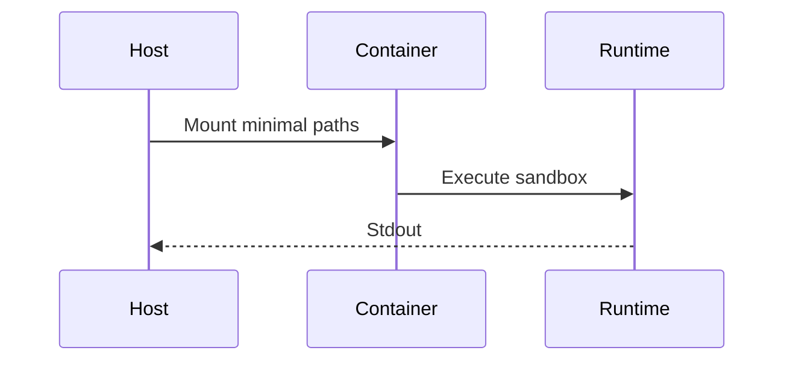

# Architecture: Containerized AI Agents

## System Diagram
The following Mermaid.js sequence diagram maps the core workflow and interactions:




This document provides a detailed overview of the architectural design, directory structure, and technical choices made in the Containerized AI Agent PoC project.

## Overview

The core purpose of this project is to demonstrate the deployment and structure of an "AI Agent" encapsulated within a microservice. By utilizing FastAPI and Docker, this project shows how machine learning models or LLM integrations can be reliably served, scaled, and managed in modern cloud-native environments.

### Key Technologies

1. **FastAPI**: Chosen for its high performance (built on Starlette and Pydantic), automatic Swagger documentation generation, and native asynchronous support, making it ideal for I/O bound tasks like interacting with external AI models.
2. **Pydantic**: Ensures strong data validation and serialization for API requests and responses.
3. **Docker**: Provides isolation and consistency, ensuring the agent runs identical regardless of the host environment.
4. **Docker Compose**: Simplifies the orchestration of the container, volume mapping (for hot-reloading in development), and port exposure.

## Directory Structure

```text
.
├── app/
│   ├── __init__.py
│   ├── agent.py      # Core simulated AI logic and state management
│   ├── main.py       # FastAPI application and endpoint definitions
│   └── models.py     # Pydantic schemas for request/response validation
├── docs/
│   └── ARCHITECTURE.md # Detailed technical documentation
├── docker-compose.yml  # Compose configuration for the service
├── Dockerfile          # Image build instructions
├── README.md           # Project overview and setup guide
└── requirements.txt    # Python dependencies
```

## Component Deep Dive

### 1. Application Layer (`app/main.py`)
This file acts as the entry point for the REST API. It initializes the FastAPI application and defines the routing.
- **`/agent/task` [POST]**: Accepts a task payload, validates it using Pydantic, and delegates the processing to the Agent instance.
- **`/agent/history/{task_id}` [GET]**: Retrieves previous task results.
- **`/health` [GET]**: A standard endpoint utilized by load balancers or container orchestrators (like Kubernetes or Docker Swarm) to verify the service is running.

### 2. The AI Agent (`app/agent.py`)
Currently implemented as a `SimpleAIAgent` singleton class. 
- In a production scenario, this class would hold the client connections to external LLMs (e.g., OpenAI API, local LLaMA models). 
- It utilizes `asyncio.sleep()` to simulate the latency inherent in LLM generation. 
- The state (task history) is stored in-memory for the sake of the PoC, but this cleanly abstracts away the potential integration of a Redis cache or a database like PostgreSQL.

### 3. Data Validation (`app/models.py`)
Using Pydantic, we define `TaskRequest` and `TaskResponse`.
- By strongly typing the inputs, FastAPI automatically rejects malformed payloads and generates descriptive HTTP 422 errors, ensuring our agent only processes clean data.

### 4. Containerization (`Dockerfile` & `docker-compose.yml`)
- The `Dockerfile` uses `python:3.11-slim` to keep the image size minimal, reducing attack surface and deployment times.
- `docker-compose.yml` mounts the `./app` directory to `/code/app` within the container. This allows developers to edit the Python code on their host machine and see changes immediately if the server was run with the `--reload` flag.

## Scalability and Future Enhancements

While this PoC is intentionally minimal, the architecture is designed to be easily extensible:
1. **Message Queues**: Integrate RabbitMQ or Kafka to decouple task submission from task processing for long-running AI jobs (using Celery).
2. **Persistent Storage**: Replace the in-memory history dictionary in `agent.py` with a PostgreSQL database via SQLAlchemy.
3. **Real LLM Integration**: Replace the mock logic with a library like `LangChain` or `LlamaIndex` to connect to real foundation models.
